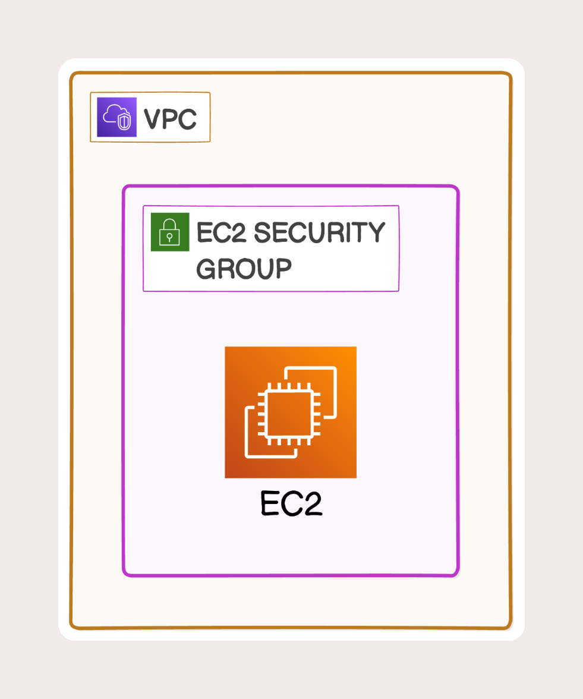
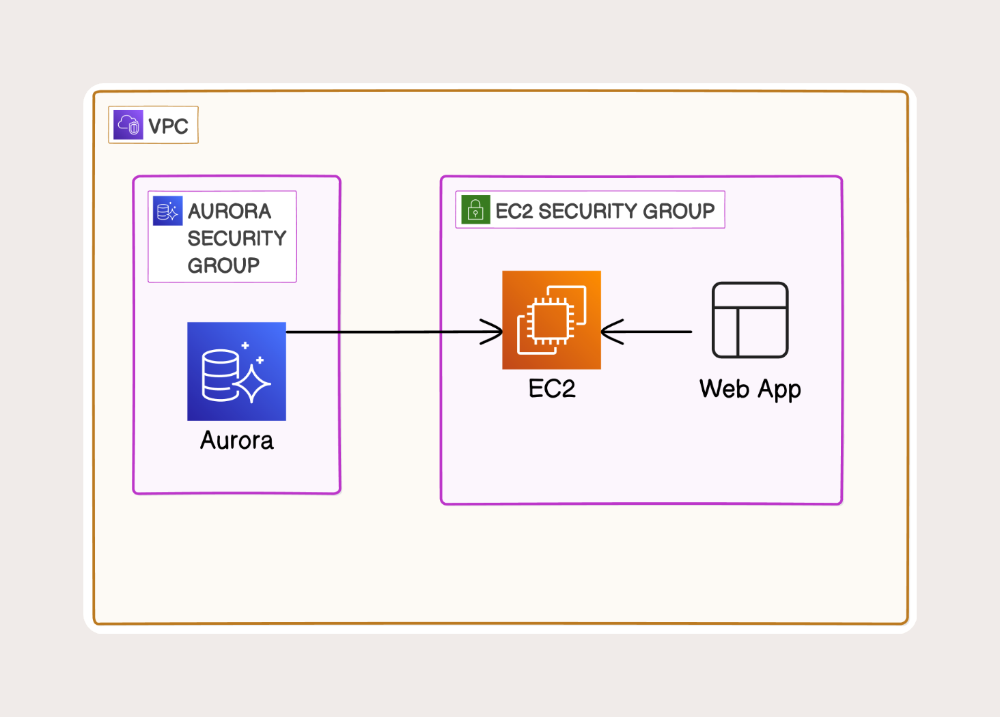

# Amazon Aurora and Web App Connectivity

This project provides a structured walkthrough of Amazon’s managed relational database services, starting with foundational database concepts and progressing into Amazon Aurora’s architecture, replication model, and high‑availability design. The project also includes a simple web application example to demonstrate how applications connect to an Aurora cluster using read/write endpoints. All documentation is supported with diagrams and step‑by‑step explanations.

---

## Project Overview

Across multiple documentation parts and diagrams, this project covers:

- Core relational database concepts  
- Overview of AWS managed database services  
- High‑level introduction to Amazon RDS  
- Aurora cluster components (Writer + Reader nodes)  
- Aurora’s distributed storage system  
- Replication and high‑availability behavior  
- Read/write endpoint usage  
- Failover and recovery workflow  
- How a web application connects to Aurora  
- End‑to‑end request flow through the database layer  

The goal is to build a clear understanding of how AWS abstracts database operations and how applications interact with Aurora in real environments.

---

## Web Application Component

A lightweight web application example is included to demonstrate:

- How applications connect to Aurora  
- How read/write endpoints are used  
- How Aurora routes traffic behind the scenes  
- How failover impacts application connectivity  

This ties the architecture back to a real‑world use case and shows how Aurora behaves from an application perspective.

---

## Workflow Diagrams

### Diagram 1 — Launching an EC2 Instance for the Web App

---

### Diagram 2 — Creating an Aurora MySQL Database and Connecting it to EC2

---

### Diagram 3 — Deploying the Web App on the EC2 Instance

---

## Skills Demonstrated

- Understanding of relational database fundamentals  
- AWS managed database service concepts  
- Aurora cluster design and scaling  
- Read/write endpoint usage  
- High‑availability and failover behavior  
- Application‑to‑database connectivity  
- Architecture documentation  
- Workflow diagram creation  

---

## About

Hands‑on AWS database project demonstrating foundational concepts, Aurora architecture, and real application connectivity through a structured, multi‑part learning approach.
